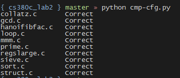
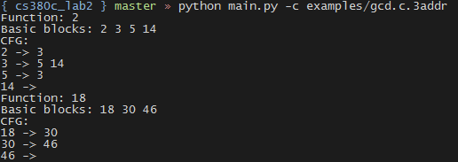

# ACT16 Programming Assignments

## Lab2

### 目标

- 构建控制流图（Control Flow Graph，CFG）
- 进行强连通区域分析（Strongly Connected Region，SCR）
- 进行可达定义分析（reaching definitions），并进行简单地常量传播（constant propagation）
- 进行活跃变量分析（live variables），并进行死代码消除（dead statement elimination）

### 构建CFG

###### 算法

构建CFG的伪代码如下：
```
leaders = {1}       // start of program
for i = 1 to |n|    // all instructions
    if instr(i) is a branch
        leaders = leaders U  targets of instr(i) U  instr(i+1)
worklist = leaders
While worklist not empty
    x = first instruction in worklist
    worklist = worklist – {x}
    block(x) = {x}
    for i = x + 1; i <= |n| && i not in leaders; i++
        block(x) = block(x) U {i}
```

###### 实现

相关的代码有

> **instruction.py**
 
实现了表示三地址代码的类、从文件中读取三地址代码的函数等。

> **cfg.py**

实现了表示基本块、控制流图的类。

> **dfa.py**

构建CFG。

###### 结果

使用lab1中的csc为源代码生成三地址代码，然后由我们实现的程序创建CFG，再使用md5sum对比我们实现的程序的输出结果和lab提供的CFG。经过对比发现，我们程序的输出结果与lab提供的一致。

用于对比结果的代码是 **cmp-cfg.py**.



### 进行SCR分析

###### 算法

[Tarjan算法](https://en.wikipedia.org/wiki/Tarjan's_strongly_connected_components_algorithm)可在O(|V| + |E|)的复杂度下识别一个图中的各个强连通分量，其伪代码为
```
algorithm tarjan is
  input: graph G = (V, E)
  output: set of strongly connected components (sets of vertices)

  index := 0
  S := empty
  for each v in V do
    if (v.index is undefined) then
      strongconnect(v)
    end if
  end for

  function strongconnect(v)
    // Set the depth index for v to the smallest unused index
    v.index := index
    v.lowlink := index
    index := index + 1
    S.push(v)
    v.onStack := true

    // Consider successors of v
    for each (v, w) in E do
      if (w.index is undefined) then
        // Successor w has not yet been visited; recurse on it
        strongconnect(w)
        v.lowlink  := min(v.lowlink, w.lowlink)
      else if (w.onStack) then
        // Successor w is in stack S and hence in the current SCC
        v.lowlink  := min(v.lowlink, w.index)
      end if
    end for

    // If v is a root node, pop the stack and generate an SCC
    if (v.lowlink = v.index) then
      start a new strongly connected component
      repeat
        w := S.pop()
        w.onStack := false
        add w to current strongly connected component
      while (w != v)
      output the current strongly connected component
    end if
  end function
```

###### 实现

> **cfg.py**

详见该文件中的SCR_analysis方法。


### 数据流分析框架

###### 算法

可达定义分析、可用表达式分析以及活跃变量分析等数据流分析方法可以共用一套分析框架。因此，在进行可达定义分析和活跃变量分析之前，我们实现了一个通用的分析框架。

对于前向的数据流分析算法，其伪代码为
```
OUT[Entry] = v_ENTRY;
for (other blocks B)
        OUT[B] = ⊤;
while (changes to any OUT)
 for (each block B) {
   IN(B) = ∧ predecessors P of B OUT(P);
        OUT(B) = fB(IN(B));
}
```

对于后向的数据流分析算法，只需将前向分析算法中的IN、OUT互换，并将Entry换为Exit。

###### 实现

> **dfa_framework.py**

### 可达定义分析与常量传播

可达定义分析，基于数据流分析框架，定义好方向、底元素、顶元素、转换函数、合并函数以及每个基本块的GEN和KILL即可。

###### 实现

> **rda.py**

常量传播的实现见该文件中的**_optimize**方法。


### 活跃变量分析和死代码消除

活跃变量分析，基于数据流分析框架，定义好方向、底元素、顶元素、转换函数、合并函数以及每个基本块的use和def即可。

###### 实现

> **lva.py**

死代码消除的实现见该文件中的**_optimize**方法。

### 可用表达式分析

考虑到我们已经实现了一个数据流分析框架，我们又用该框架实现了可用表达式分析。

###### 实现

> **aea.py**


### 如何运行程序

我们将以上各个模块包装在文件**dfa.py**中。我们又编写了**main.py**以命令行运行方式提供了更好的用户交互接口。

main.py的运行方法是
```bash
$ python main.py [-c] [-r] [-l] <3addr_code_file_name>
```

各个参数的含义是

- -c，输出控制流图
- -r，进行可达定义分析和常量传播优化
- -l，进行活跃变量分析和死代码消除优化

以上三个选项可以只输入一个，也可全部输入。

###### 运行示例




